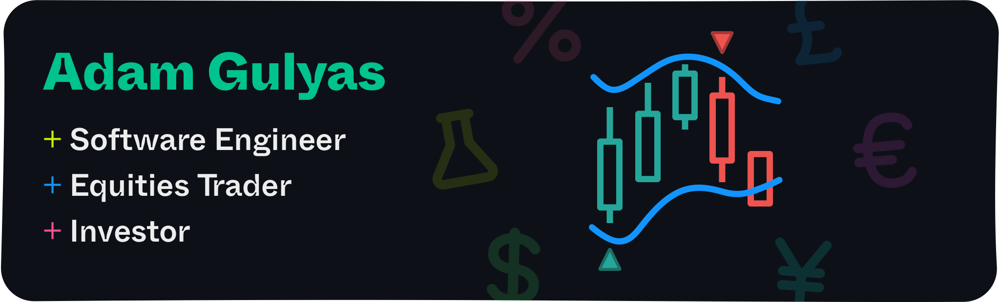

# Hello! &nbsp;:wave:

I'm Adam, a Quantitative Analyst/Data Scientist based in Toronto. Currently studying FinTech at University of Toronto, focusing on predictive analytics and algorithmic trading with Machine Learning, Natural Language Processing, Deep Learning, and Technical Analysis.

To learn more about me, check out [my website](https://adamgulyas.com) or [LinkedIn](https://linkedin.com/in/adamgulyas).

## Technologies & Tools &nbsp;:toolbox:

\

\

\

## Work Experience &nbsp;:necktie:
| Position                    | Company               | Field                           | Time Period          |
| --------------------------- | --------------------- | ------------------------------- | -------------------- |
| Technology Director         | G&G                   | Digital Marketing               | 03/2020 — 02/2022    |
| Technical Product Manager   | Vicarious Inc.        | Startup Consulting              | 06/2019 — 03/2020    |
| Technical Product Manager   | The Young Astronauts  | Creative Technology             | 02/2015 — 06/2019    |
| Lead Software Engineer      | The Young Astronauts  | Creative Technology             | 04/2014 — 02/2015    |
| Software Engineer           | Yelp                  | Consumer Analytics              | 06/2013 — 04/2014    |

## Education &nbsp;:mortar_board:

Certificate, FinTech\
**University of Toronto, Toronto, ON**

Diploma, Internet Applications & Web Development\
**Durham College, Oshawa, ON**

B.A., Philosophy\
**University of Guelph, Guelph, ON**

## Achievements &nbsp;:trophy:

- Clio Gold, Social Media
- Clio Gold, Music Entertainment
- Cannes Lion Bronze, Social Media
- Published in Bloomberg, Wired, TechCrunch, and Billboard

## I :heart_on_fire: Finance

Apart from data science and engineering, I'm an investor, speculator, and equities/options trader. The combination of working between these two fields is, personally, extremely fulfulling. At the root of it all, I'm fuelled by a deep fascination of economic systems and the desire to fit the pieces together, and always in pursuit of a greater understanding.

### Currently Reading &nbsp;:books:

- **Hands-On Machine Learning with Scikit-Learn, Keras, and TensorFlow** (Aurélien Géron - O'Reilly)
- **Data Preparation for Machine Learning: Data Cleaning, Feature Selection, and Data Transforms in Python** (Jason Brownlee)
- **Principles of Professional Speculation** (Victor Sperandeo, T. Sullivan Brown - Wiley)
- **Trading Options Greeks: How Time, Volatility, and Other Pricing Factors Drive Profits** (Dan Passarelli - Bloomberg)
